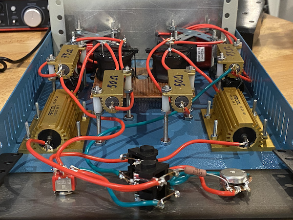

# ReactiveLoad

This is a reactive load intended for use with guitar/bass amplifiers up to 100W. The load simulates the impedance response of a speaker cabinet and has a line level output that can be connected to an audio interface. A switch enables the user to choose between 3 operating modes of 4Ω, 8Ω and 16Ω, this is achieved with 2 identical 8Ω loads the are connected in series/parallel to get the 4 and 16 ohm ratings.

LTSpice simulations can be found under the spice directory.

